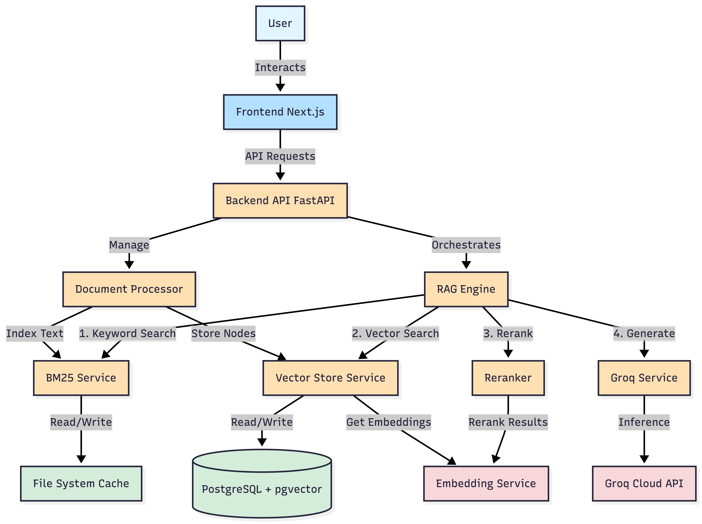

# System Architecture

**Author**: Shivam Sourav  
**Version**: 1.0  
**Last Updated**: January 12, 2026  
**Status**: Active Development

## Document Overview

This document communicates the high-level architecture, component interactions, and data flows of the Professional Grade RAG system. It serves as the primary reference for developers, architects, and stakeholders to understand the system design, technical decisions, and implementation details.

## 1. System Overview

The system is a professional-grade Retrieval-Augmented Generation (RAG) application designed for high-performance document question answering. It utilizes a microservices-based architecture with a modern frontend, a robust FastAPI backend, and a dedicated embedding/reranking service.

### Design Principles
- **Modularity**: Each component is independently deployable and maintainable.
- **Scalability**: Horizontal scaling capabilities for high-traffic scenarios.
- **Performance**: Optimized for low-latency responses (< 2 seconds for most queries).
- **Accuracy**: Multi-stage retrieval and reranking for high precision answers.
- **Maintainability**: Clean code architecture with comprehensive documentation.

### Key Features
- **Hybrid Retrieval**: Combines keyword search (BM25) with semantic vector search for optimal recall.
- **Advanced Reranking**: Uses cross-encoder models to re-order retrieved documents by relevance.
- **High-Speed Inference**: Leverages Groq's LPU (Language Processing Unit) for near-instant responses (up to 750 tokens/second).
- **Scalable Storage**: Uses PostgreSQL with `pgvector` for efficient vector storage and metadata management.
- **Context-Aware Responses**: Maintains conversation history for multi-turn dialogues.
- **Source Attribution**: Provides citations and confidence scores for transparency.

## 2. Architecture Diagram

## 3. Component Details

### 3.1 Frontend (`/frontend`)
- **Framework**: Next.js 14 (React) with TypeScript.
- **Styling**: Tailwind CSS + Shadcn/ui.
- **Key Responsibilities**:
  - Chat Interface for user interaction.
  - File Upload management.
  - Visualization of confidence scores and source citations.
  - Authentication views.

### 3.2 Backend (`/backend`)
- **Framework**: FastAPI (Python).
- **Orchestration**: LlamaIndex.
- **Key Components**:
  - **`rag_engine.py`**: The core controller that manages the retrieval and generation workflow.
  - **`retriever.py`**: Implements hybrid retrieval using `QueryFusionRetriever` (BM25 + Vector).
  - **`reranker.py`**: Applies cross-encoder scoring to improve result relevance.
  - **`confidence_scorer.py`**: Calculates confidence metrics for generated answers.
  - **`document_processor.py`**: Handles file parsing, chunking (SentenceSplitter with 512 token chunks, 50 token overlap), and indexing.
  - **`vector_store.py`**: Manages interactions with PostgreSQL `pgvector`.
  - **`groq_service.py`**: Interface to Groq API for LLM inference.
  - **Middleware**: JWT authentication, CORS, rate limiting, and error handling.

### 3.3 Embedding Service (`/embedding_service`)
- **Framework**: FastAPI (Microservice).
- **Key Responsibilities**:
  - **Embedding Generation**: Generates vector embeddings for text chunks using Ollama (`embeddinggemma`).
  - **Reranking**: Scores relevance between query and document pairs using a Cross-Encoder (`mixedbread-ai/mxbai-rerank-large-v2`).
- **Deployment**: Can be deployed independently or via Lightning.ai.

### 3.4 Database
- **Primary DB**: PostgreSQL 15+.
- **Extensions**: `pgvector` for vector similarity search (cosine similarity).
- **Tables**:
  - `data_embeddings`: Stores vectors (768 dimensions), document chunks, and metadata.
  - `chat_sessions`: Stores conversation history with timestamps and user associations.
  - `chat_messages`: Individual messages with role (user/assistant) and content.
  - `users`: User management with authentication credentials.
  - `documents`: Document metadata including upload time, file size, and processing status.
- **Indexing**: 
  - Vector indexes using HNSW for fast approximate nearest neighbor search.
  - B-tree indexes on frequently queried fields (user_id, session_id, timestamps).

## 4. Data Flows

### 4.1 Data Ingestion Pipeline
1. **Upload**: User uploads a document (PDF, TXT, etc.) via Frontend.
2. **Processing**: `DocumentProcessor` reads the file and extracts text.
3. **Chunking**: Text is split into overlapping chunks (e.g., 512 tokens).
4. **Embedding**: Chunks are sent to `Embedding Service` to generate vector representations.
5. **Storage**:
   - Vectors are stored in PostgreSQL (`pgvector`).
   - Text is indexed in the BM25 service for keyword search.

### 4.2 RAG Query Pipeline
1. **Query**: User submits a question.
2. **Retrieval**:
   - **Vector Search**: Finds semantically similar chunks from PostgreSQL.
   - **Keyword Search**: Finds exact keyword matches via BM25.
   - **Fusion**: Results are merged using Reciprocal Rank Fusion (RRF).
3. **Reranking**: The top retrieval results are sent to the `Embedding Service` to be reranked by the Cross-Encoder model for higher precision.
4. **Context Construction**: The top reranked chunks are formatted into a system prompt.
5. **Generation**: The prompt is sent to Groq (Llama 3) to generate the final answer.
6. **Response**: The answer, along with confidence scores and source citations, is returned to the user.

## 5. Technology Stack

| Component | Technology |
|-----------|------------|
| **Frontend** | Next.js, TypeScript, Tailwind CSS |
| **Backend API** | FastAPI, Pydantic |
| **Orchestration** | LlamaIndex |
| **LLM** | Llama 3 (via Groq) |
| **Embeddings** | Gemma (via Ollama) |
| **Reranking** | mixedbread-ai/mxbai-rerank-large-v2 |
| **Vector DB** | PostgreSQL + pgvector |
| **Containerization** | Docker, Docker Compose |
| **Keyword Search** | BM25 (Rank-BM25) |
| **Authentication** | JWT Tokens |

## 6. Deployment Architecture

### 6.1 Local Development
- All services run via Docker Compose.
- Hot-reload enabled for rapid development.
- Local PostgreSQL instance with sample data.

### 6.2 Production Deployment
- **Frontend**: Deployed on Vercel or similar edge platform.
- **Backend API**: Containerized deployment on AWS ECS/EKS or similar.
- **Embedding Service**: Can be deployed on Lightning.ai or dedicated GPU instances.
- **Database**: Managed PostgreSQL service (AWS RDS, Supabase, etc.).
- **Load Balancing**: NGINX or cloud-native load balancers.
- **CDN**: CloudFront or similar for static assets.

## 7. Security Considerations

### 7.1 Authentication & Authorization
- JWT-based authentication with secure token storage.
- Password hashing using bcrypt.
- Role-based access control (RBAC) for multi-tenant scenarios.

### 7.2 Data Protection
- TLS/SSL encryption for all API communications.
- Database connection encryption.
- Secure environment variable management.
- Input validation and sanitization to prevent injection attacks.

### 7.3 API Security
- Rate limiting to prevent abuse.
- CORS policy enforcement.
- Request size limits.
- API key rotation policies.

## 8. Performance Optimization

### 8.1 Caching Strategy
- Embedding cache for frequently queried documents.
- Session-based context caching.
- Query result caching with TTL.

### 8.2 Retrieval Optimization
- Hybrid search reduces false negatives.
- Reranking improves precision while maintaining recall.
- Configurable top-k parameters for different use cases.

### 8.3 Response Times
- Target: < 2 seconds for end-to-end query.
- Retrieval: ~200-500ms.
- Reranking: ~300-800ms.
- LLM Generation: ~500-1000ms (with Groq acceleration).

## 9. Monitoring & Observability

### 9.1 Metrics
- Query latency and throughput.
- Retrieval accuracy (precision@k, recall@k).
- Model inference times.
- Database query performance.
- API error rates.

### 9.2 Logging
- Structured logging with log levels (DEBUG, INFO, WARNING, ERROR).
- Request/response logging for debugging.
- Error tracking and alerting.

### 9.3 Health Checks
- Endpoint health monitoring.
- Database connection health.
- External service availability checks.

## 10. Future Enhancements

- **Multi-modal Support**: Add support for images and tables in documents.
- **Advanced Query Understanding**: Query expansion and intent classification.
- **Streaming Responses**: Real-time token streaming for better UX.
- **Fine-tuned Models**: Custom fine-tuned embeddings for domain-specific use cases.
- **Analytics Dashboard**: User behavior analytics and system performance metrics.
- **Multi-language Support**: Expand beyond English for global deployment.
