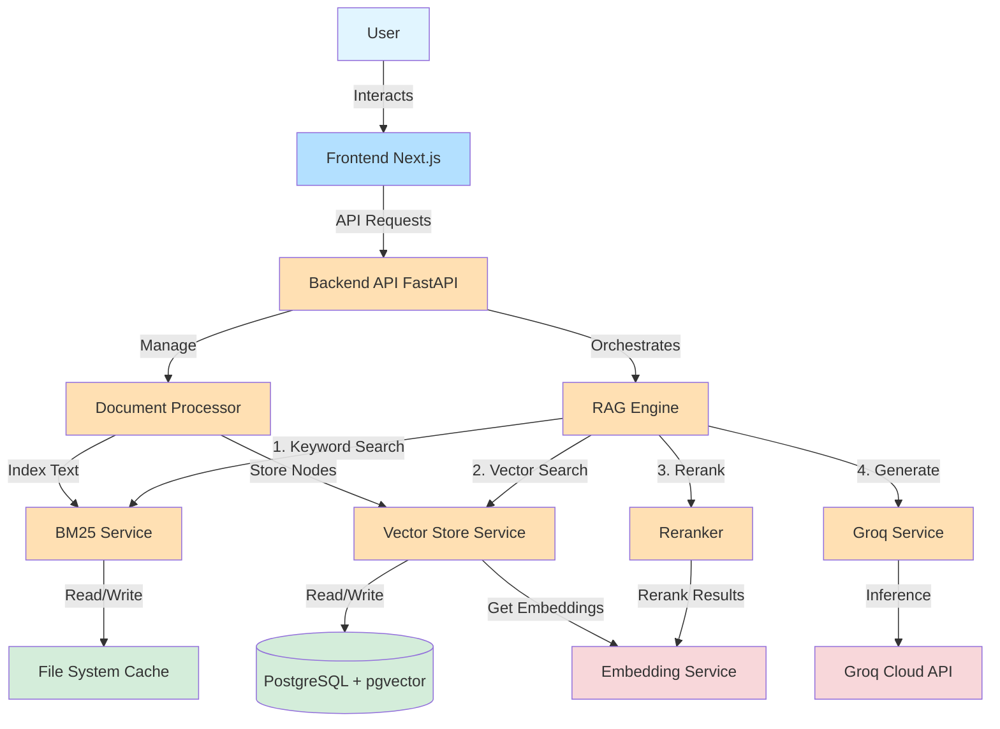

# System Architecture

This document communicates the high-level architecture, component interactions, and data flows of the Professional Grade RAG system.

## 1. System Overview

The system is a professional-grade Retrieval-Augmented Generation (RAG) application designed for high-performance document, question answering. It utilizes a microservices-based architecture with a modern frontend, a robust FastAPI backend, and a dedicated embedding/reranking service.

### Key Features
- **Hybrid Retrieval**: Combines keyword search (BM25) with semantic vector search for optimal recall.
- **Advanced Reranking**: Uses cross-encoder models to re-order retrieved documents by relevance.
- **High-Speed Inference**: Leverages Groq's LPU (Language Processing Unit) for near-instant generic responses.
- **Scalable Storage**: Uses PostgreSQL with `pgvector` for vector storage and metadata management.

## 2. Architecture Diagram

## 3. Component Details

### 3.1 Frontend (`/frontend`)
- **Framework**: Next.js 14 (React) with TypeScript.
- **Styling**: Tailwind CSS + Shadcn/ui.
- **Key Responsibilities**:
  - Chat Interface for user interaction.
  - File Upload management.
  - Visualization of confidence scores and source citations.
  - Authentication views.

### 3.2 Backend (`/backend`)
- **Framework**: FastAPI (Python).
- **Orchestration**: LlamaIndex.
- **Key Components**:
  - **`rag_engine.py`**: The core controller that manages the retrieval and generation workflow.
  - **`retriever.py`**: Implements hybrid retrieval using `QueryFusionRetriever` (BM25 + Vector).
  - **`document_processor.py`**: Handles file parsing, chunking (SentenceSplitter), and indexing.
  - **`vector_store.py`**: Manages interactions with PostgreSQL `pgvector`.

### 3.3 Embedding Service (`/embedding_service`)
- **Framework**: FastAPI (Microservice).
- **Key Responsibilities**:
  - **Embedding Generation**: Generates vector embeddings for text chunks using Ollama (`embeddinggemma`).
  - **Reranking**: Scores relevance between query and document pairs using a Cross-Encoder (`mixedbread-ai/mxbai-rerank-large-v2`).
- **Deployment**: Can be deployed independently or via Lightning.ai.

### 3.4 Database
- **Primary DB**: PostgreSQL.
- **Extensions**: `pgvector` for vector similarity search.
- **Tables**:
  - `data_embeddings`: Stores vectors and document chunks.
  - `chat_sessions`: Stores conversation history.
  - `users`: User management.

## 4. Data Flows

### 4.1 Data Ingestion Pipeline
1. **Upload**: User uploads a document (PDF, TXT, etc.) via Frontend.
2. **Processing**: `DocumentProcessor` reads the file and extracts text.
3. **Chunking**: Text is split into overlapping chunks (e.g., 512 tokens).
4. **Embedding**: Chunks are sent to `Embedding Service` to generate vector representations.
5. **Storage**:
   - Vectors are stored in PostgreSQL (`pgvector`).
   - Text is indexed in the BM25 service for keyword search.

### 4.2 RAG Query Pipeline
1. **Query**: User submits a question.
2. **Retrieval**:
   - **Vector Search**: Finds semantically similar chunks from PostgreSQL.
   - **Keyword Search**: Finds exact keyword matches via BM25.
   - **Fusion**: Results are merged using Reciprocal Rank Fusion (RRF).
3. **Reranking**: The top retrieval results are sent to the `Embedding Service` to be reranked by the Cross-Encoder model for higher precision.
4. **Context Construction**: The top reranked chunks are formatted into a system prompt.
5. **Generation**: The prompt is sent to Groq (Llama 3) to generate the final answer.
6. **Response**: The answer, along with confidence scores and source citations, is returned to the user.

## 5. Technology Stack

| Component | Technology |
|-----------|------------|
| **Frontend** | Next.js, TypeScript, Tailwind CSS |
| **Backend API** | FastAPI, Pydantic |
| **Orchestration** | LlamaIndex |
| **LLM** | Llama 3 (via Groq) |
| **Embeddings** | Gemma (via Ollama) |
| **Reranking** | mixedbread-ai/mxbai-rerank-large-v2 |
| **Vector DB** | PostgreSQL + pgvector |
| **Containerization** | Docker, Docker Compose |
